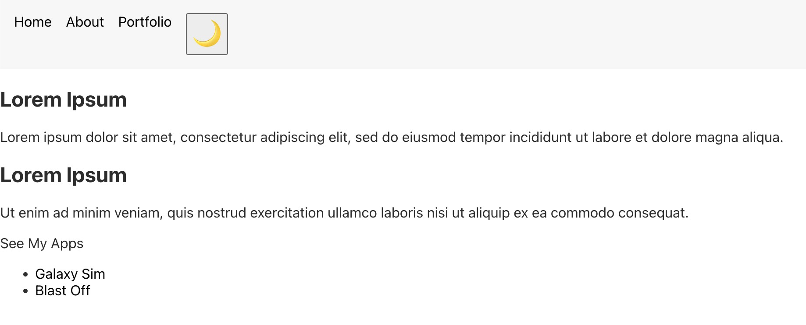
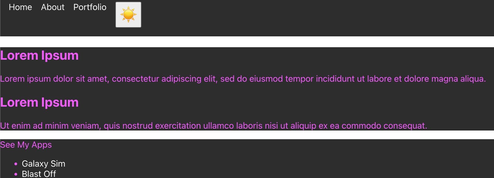

# React Context Example

This simple application implements a simple React context provider for passing theme (light/dark) down to child components. While this example is a bit contrived due to the simplicity of the application. As applications grow in size these components may become further nested with child components who may or may not need to be aware of the theme context. The ThemeContext allows us to control theme without resorting to excessive prop drilling through components who may not care about theming.

To start the app, run:
`yarn install`
`yarn start`

The app is very simple and contains:

- a header with nav items including a theme toggling button
- a body with simple placeholder text
- and a footer with simple placeholder text

